 # Installation instructions

  - [Overview](#overview)
  - [Set up storage account for queues and blob storage](#set-up-storage-account-for-queues-and-blob-storage)
    - [Create queue](#create-queue)
    - [Create Blob storage](#create-blob-storage)
  - [Set up key vault](#set-up-key-vault)
  - [Grant key vault access to an Azure AD application](#grant-key-vault-access-to-an-azure-ad-application)
  - [Add the secret to hold the hosted subscription credentials](#add-the-secret-to-hold-the-hosted-subscription-credentials)
  - [Clone the repository, create an Azure SQL Database single database and prepare](#clone-the-repository-create-an-azure-sql-database-single-database-and-prepare)
  - [Change configuration](#change-configuration)
  - [Create Web Apps on Azure and deploy the code](#create-web-apps-on-azure-and-deploy-the-code)
    - [Running the solution locally](#running-the-solution-locally)
  - [Landing page and webhook settings for the SaaS offer on Partner Center](#landing-page-and-webhook-settings-for-the-saas-offer-on-partner-center)
  - [Next steps](#next-steps)
    - [Configuring the Customer Provisioning web application](./Customer-Experience.md)
    - [Configuring the Publisher Provisioning web application](./Publisher-Experience.md)
## Overview

This document describes how to implement the required components to enable the SDK for the SaaS Fulfillment API (v2), Marketplace Metering Service API, and additional components that demonstrate how to build a customer provisioning interface, logging, and administration of the customer's subscriptions.

Learn more about what's included and how to-use the SDK [here.](https://github.com/Azure/Microsoft-commercial-marketplace-transactable-SaaS-offer-SDK/blob/master/README.md)

Please note: this SDK is community-supported. If you need help or have questions using this SDK, please create a GitHub issue. Do not contact the marketplace pubisher support alias directly regarding use of this SDK. Thank you.

## Set up storage account for queues and blob storage
- Log on to [Azure](https://portal.azure.com)
- Click **Create a resource** in the left menu

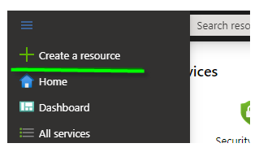
- Type **storage account** in the search box in the top bar
- Click the item labelled **Storage account - blob, file, table, queue** in the results to navigate to the **Storage Account** creation page
- Click **Create** button to initiate the creation of a storage account

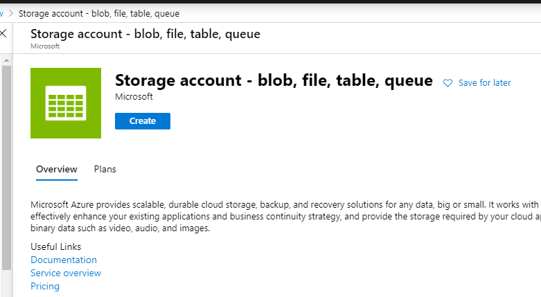
- Fill out the details in the **Basics** tab 
  - Select a **Subscription** and **Resource Group**
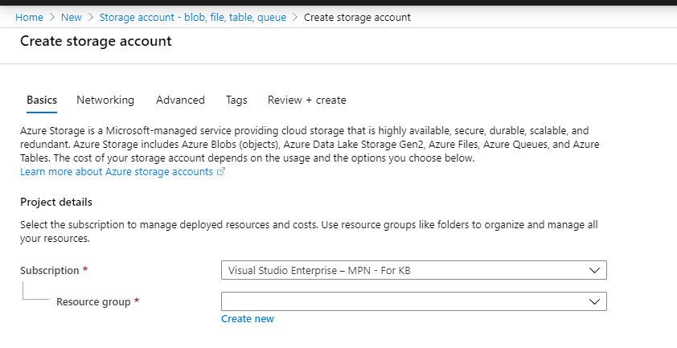

- Fill out the **Instance Details** section by providing the values for the following fields as illustrated in the below image
   
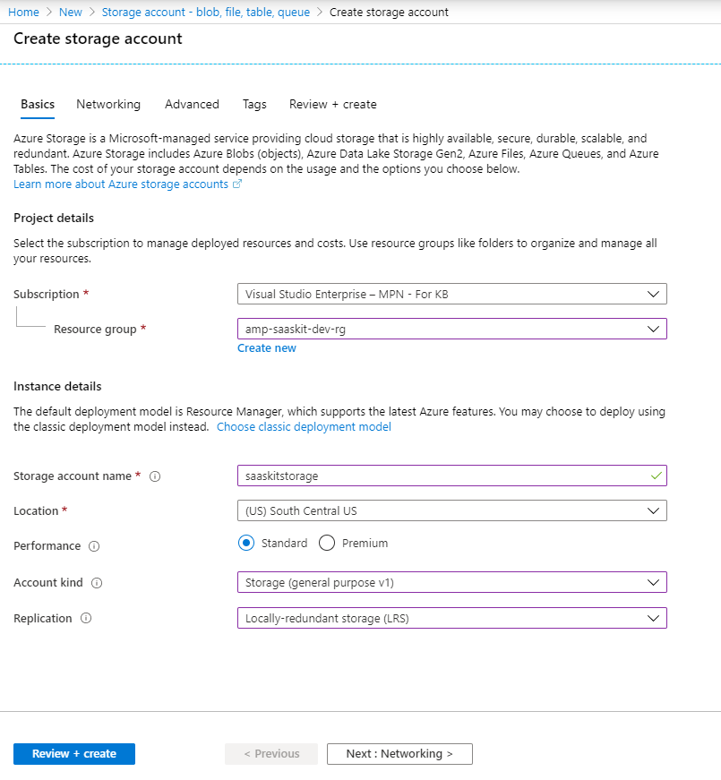

- Click **Review + Create**
- **Create** button appears after the validation of the input is complete
- Click **Create** to create the storage account
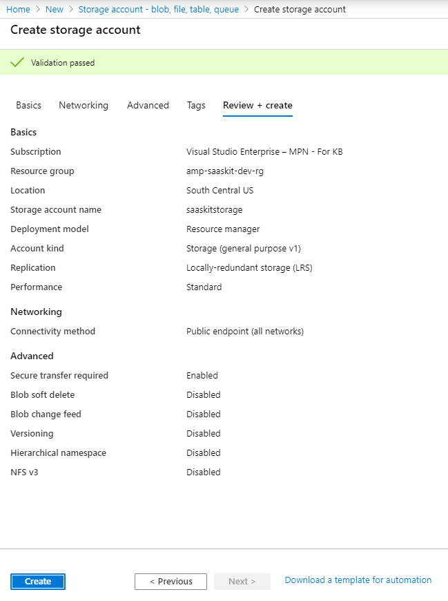

### Create queue

- After creating the **Storage Account**, navigate to the resource and search for **Queue**
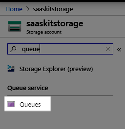
- Click **Queues** from the menu in the left
- Click **Add Queue** button in the top bar
- In the pane that opens, provide the name of the queue as **saas-provisioning-queue**
- > Note: The name of the queue is important and should read **saas-provisioning-queue** as the webjob monitors the storage account for messages in a queue named **saas-provisioning-queue**

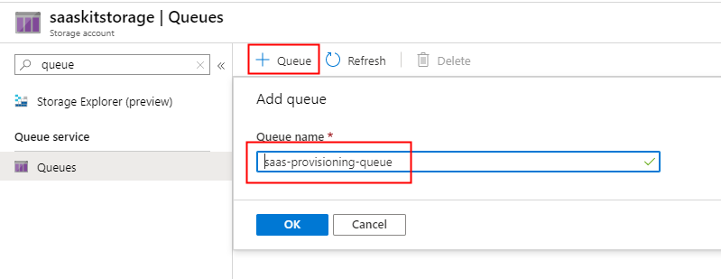
- Navigate to the **Storage Account**, click **Access Keys** item in the left menu
- Copy the value in the field labelled **Connection string** as shown in the below image

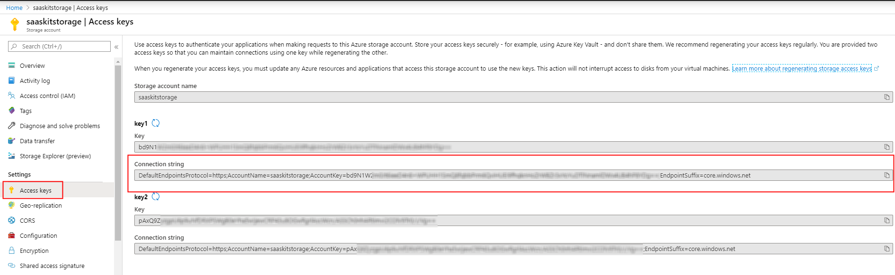
- The connection string is going to be used as the value for the keys **AzureWebJobsStorage** and **AzureBlobConfig** > **BlobConnectionString** in appSettings.json / Azure application configuration

### Create Blob storage

- Azure blob storage is used to hold the ARM template files
- Navigate to the **Storage Account** that was created earlier
- Click **Containers** in the **Blob service** section in the left menu
- Click **+ Container** button in the top bar
- Give the container a name and set the access level as **Private (no anonymous access)** 

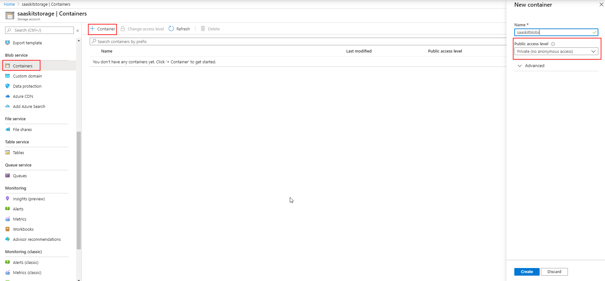

- The name of the container should be set as value for the key **AzureBlobConfig** > **BlobContainer** in appSettings.json / Azure application configuration

## Set up key vault

- Log on to [Azure](https://portal.azure.com)
- Search for **Key vaults** in the search box in the top bar
- Click **Key vaults**
- Click **+ Add** to add a new key vault
- Fill out the **Basics** using the below image as a reference

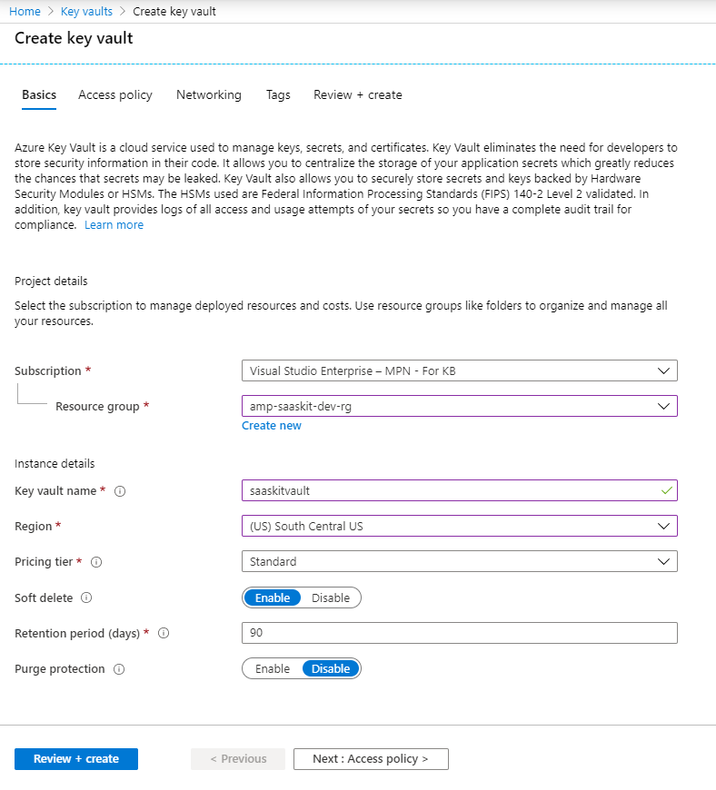

- Click **Review + Create**  to trigger the validation of the input detail

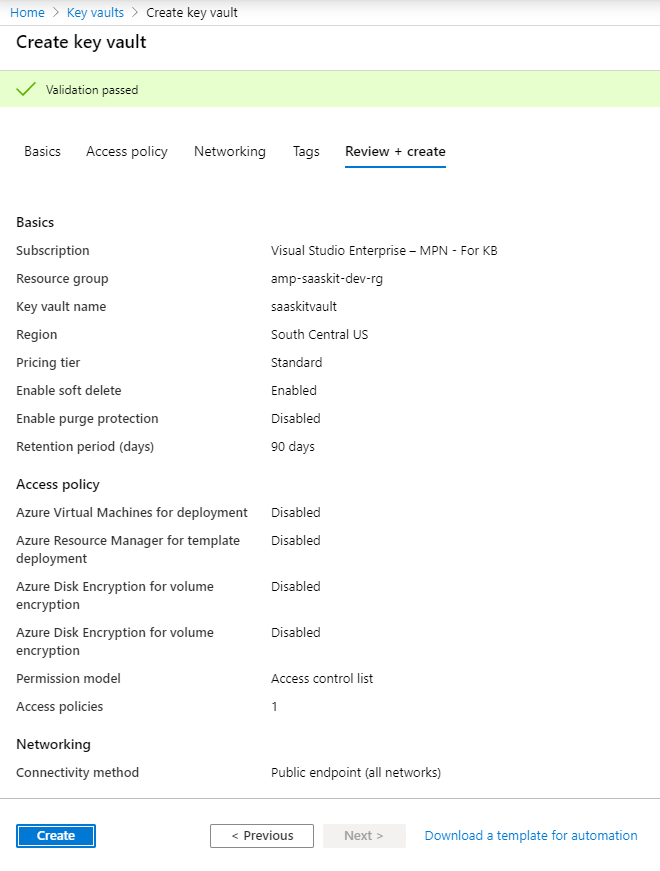

- Click **Create** to create the key vault

## Grant key vault access to an Azure AD application

- Log on to [Azure](https://portal.azure.com)
- Click **Azure Active Directory** in the left menu
- Click **App registrations** in the left menu
- Click **+ New registration** button in the top bar
- Provide a name to the application and click **Create**

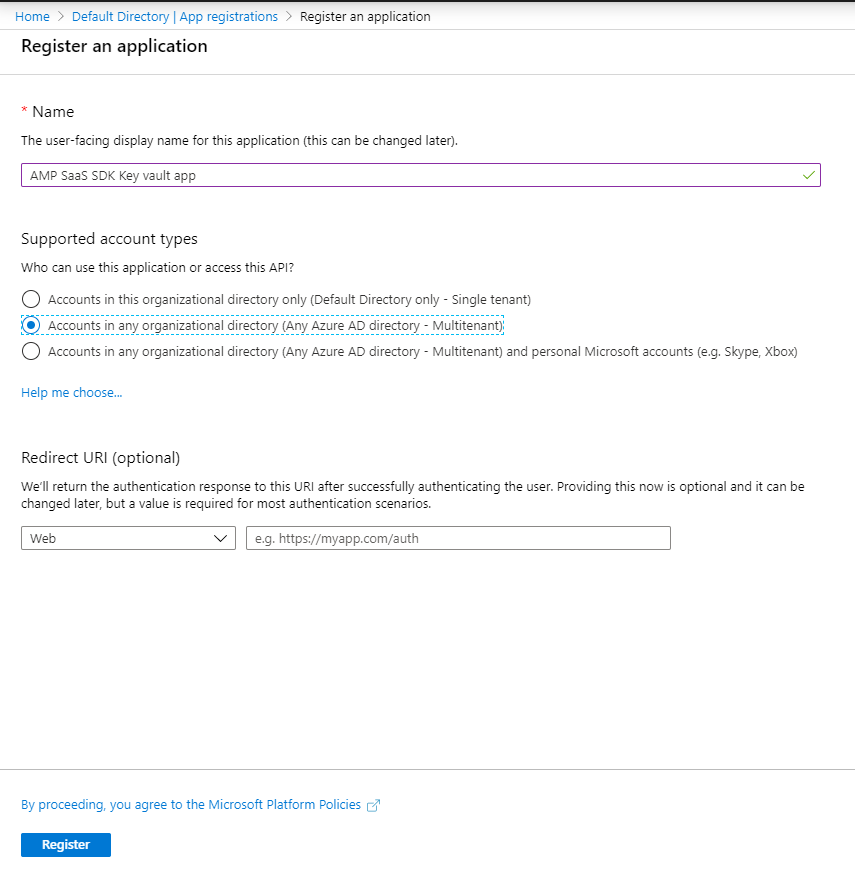
- Grab the **Application ID** and the **Tenant ID** values from the **Overview** section

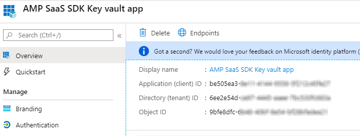
- Click **Certificates & secrets** 
- Click **+ New client secret** to generate a new secret
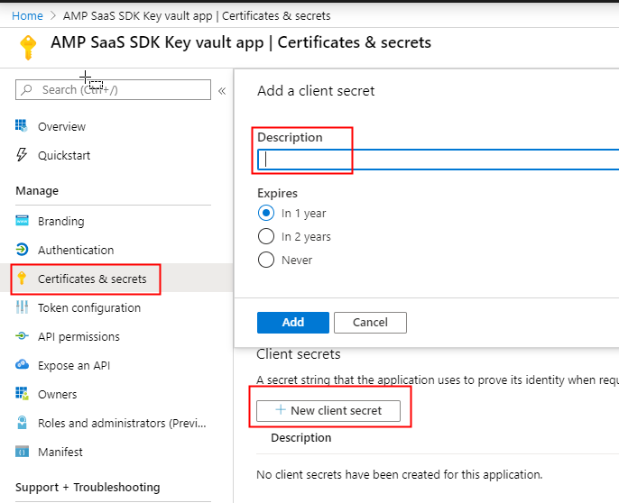
- Give a name to the secret and copy the secret value to a text file. The secret, AD Application ID and the tenant ID 
- Click **API permissions** 
- Click **+ Add permission**
- Select **Azure Key Vault** from the list under **Microsoft APIs**
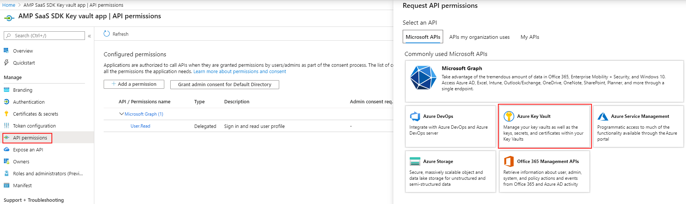

- Select the **user_impersonation** permission and click **Add permissions**
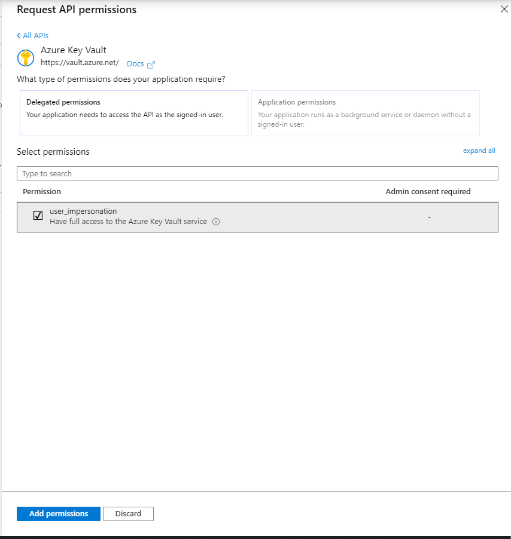

- Now, navigate to the key vault that we created in an earlier step
- Click **Access policies** menu item on the left
- Click **+ Add access policy**
- Open the dropdown - **key permissions** and **Select all**
- Open the dropdown - **secret permissions** and **Select all**
- Click the field next to **Select principal** and search for the AD app that was just created
- Select the AD app from the search results and Click **Select**

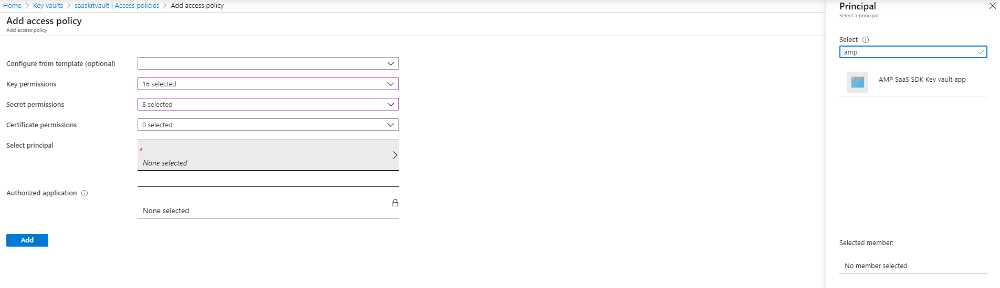
- Click **Add** to give the AD app permission to access the key vault
- Go to the **Overview** and copy the key vault URL ( DNS name)
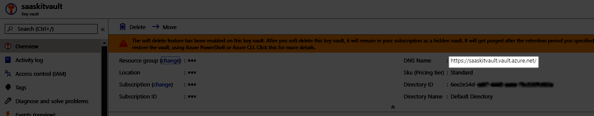

- The key vault url should be used in the **keyVaultConfig** > **KeyVaultUrl** 

## Add the secret to hold the hosted subscription credentials

- Log on to [Azure](https://portal.azure.com)
- Search for **Key vaults** in the search box in the top bar
- Click **Key vaults**
- Locate the key vault that was just created
- Click **Secrets** from the left menu
- Click **+Generate/Import** button in the top bar
- Add the details as shown in the below image
    - Name : **HostedsubscriptionCredentials**
    - Value : 
```json    
{
"Tenant ID":"<tenantID>",
"Subscription ID":"<Azure Subscription ID>",
"Service Principal ID":"<service principal that has contributor permissions on the Azure subscription>",
"Client Secret":"<secret of the service principal>"
} 
```

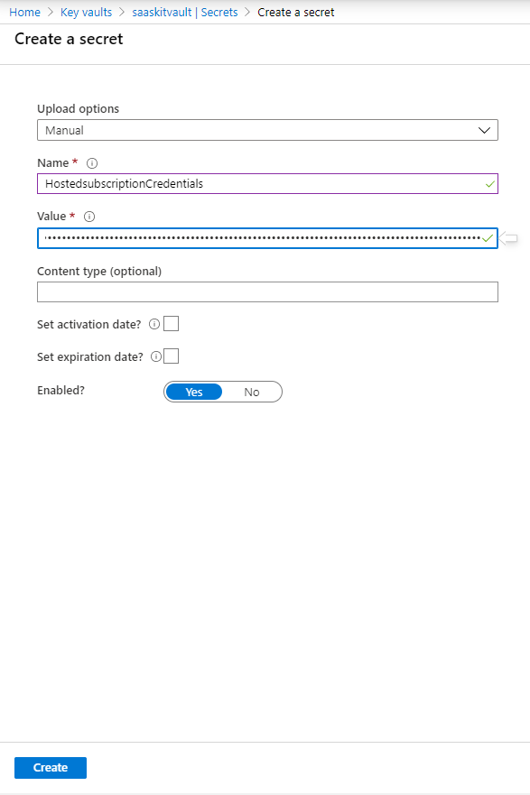

## Clone the repository, create an Azure SQL Database single database and prepare
 Create a single database following the instructions on the SQL Database service [quickstart] (https://docs.microsoft.com/en-us/azure/sql-database/sql-database-single-database-get-started?tabs=azure-portal) document.

 - Run the script **AMP-DB-2.1.sql** to initialize the database using your favorite SQL management tool, such as [SQL Server Management Studio](https://docs.microsoft.com/en-us/sql/ssms/download-sql-server-management-studio-ssms?view=sql-server-ver15), or [Azure Data Studio](https://docs.microsoft.com/en-us/sql/azure-data-studio/download-azure-data-studio?view=sql-server-ver15). The scripts are in [deployment/database](../deployment/Database) folder.

 - Run the script  **AMP-DB-2.2.sql** to update your existing database to 2.2.
 
 - Run the script  **AMP-DB-2.3.sql** to update your existing database to 2.3.
 
- Add the email for the Azure Active Directory user you are planning to log in to the solution to **KnownUsers** table on the database, with value "1" for the RoleId column. For example, if the user is expected to login with **user@contoso.com** run the following script in your favorite management tool.

    ``` sql
      INSERT INTO KnownUsers (UserEmail, RoleId) VALUES ('user@contoso.com', 1)
    ```

## Change configuration

Open the files **appsettings.json** under the project **SaaS.SDK.CustomerProvisioning** and **SaaS.SDK.PublisherSolution** update the values as follows:
- **GrantType** - Leave this as `client_credentials`
- **ClientId** - Azure Active Directory Application ID (the value for marketplace offer in Partner Center, under technical configuration tab). Steps to register an Azure AD application are [here](https://docs.microsoft.com/en-us/azure/marketplace/partner-center-portal/pc-saas-registration)
- **ClientSecret** - Secret from the Azure Active Directory Application
- **Resource** - Set this to *62d94f6c-d599-489b-a797-3e10e42fbe22* **this value is important, it is the resource ID for the fulfillment API**
- **FulFillmentAPIBaseURL** - https://marketplaceapi.microsoft.com/api
- **SignedOutRedirectUri** - Set the path to the page the user should be redirected to after signing out from the application
- **TenantId** - Provide the tenant ID detail that was submitted in the. **Technical configuration** section of your marketplace offer in Partner Center.
- **FulfillmentApiVersion** - Use 2018-08-31 for the production version of the fulfillment APIs
- **AdAuthenticationEndpoint** - https://login.microsoftonline.com
- **SaaSAppUrl** - URL to the SaaS solution 
- **DefaultConnection** - Set the connection string to connect to the database.     
- **AzureWebJobsStorage** - Connection string to the Azure storage queue. Adding a message to this queue would trigger the **Provisioning webjob** that monitors the queue for messages
    - **keyVaultConfig** - Contains the credentials to access the key vault. Key vault is used as the storage to keep the sensitive information related to deployment of ARM templates
        - **ClientID** - Azure AD Application ID that has access to the key vault
        - **ClientSecret** - Secret for the AD application ID that has access to the key vault
        - **KeyVaultUrl** - URL to the key vault
        - **TenantID** - ID of the tenant where the Azure AD application that can access the key vault exists
    - **AzureBlobConfig**  - Contains the access detail to the Azure blob storage. ARM templates uploaded via the publisher solution are stored in the Azure Blob storage
      - **BlobContainer** - Name of the container for the blob storage
      - **BlobConnectionString** - Connection string to the Azure Blob storage 

After making all of the above changes, the **appSettings.json** would look like sample below.

```json
{
  "Logging": {
    "LogLevel": {
      "Default": "Information",
      "Microsoft": "Warning",
      "Microsoft.Hosting.Lifetime": "Information"
    }
  },
  "SaaSApiConfiguration": {
    "GrantType": "client_credentials",
    "ClientId": "<Azure AD application ID>",
    "ClientSecret": "<client secret>",
    "Resource": "62d94f6c-d599-489b-a797-3e10e42fbe22",
    "FulFillmentAPIBaseURL": "https://marketplaceapi.microsoft.com/api",
    "SignedOutRedirectUri": "<provisioning_or_publisher_web_app_base_path>/Home/Index",
    "TenantId": "<TenantID of AD application>",
    "FulFillmentAPIVersion": "2018-08-31",
    "AdAuthenticationEndPoint": "https://login.microsoftonline.com",
    "SaaSAppUrl" : "<Link-to-SaaS-application>"
  },
  "connectionStrings" : {
    "DefaultConnection": "Data source=<server>;initial catalog=<database>;user id=<username>;password=<password>"
    },
  "AllowedHosts": "*"
 "AzureWebJobsStorage": "<Connection String for storage queue. Enqueueing a message to this queue triggers the webjob>",
  "keyVaultConfig": {
    "ClientID": "<Azure-AD-Application-ID>",
    "ClientSecret": "***********",
    "KeyVaultUrl": "<Url for azure key vault>",
    "TenantID": "<TenantID-of-AD-Application>"
  },
  "AzureBlobConfig": {
    "BlobContainer": "<Azure storage account container>",
    "BlobConnectionString": "<Azure storage account  connection string>"
  }
}
```

## Create Web Apps on Azure and deploy the code

The sample has two web apps to demonstrate the activation of a subscription for a SaaS offer, and potential scenarios for managing subscriptions and users. 

There are many ways to create Web App resources on [App Service](https://docs.microsoft.com/en-us/azure/app-service/) and deploy the code,
- Using Azure portal
- Using command line tools, [Azure CLI](https://docs.microsoft.com/en-us/azure/app-service/samples-cli), [Azure PowerShell](https://docs.microsoft.com/en-us/azure/app-service/samples-powershell) and [Resource Manager (ARM) templates](https://docs.microsoft.com/en-us/azure/app-service/samples-resource-manager-templates)
- [Using Visual Studio Code](https://docs.microsoft.com/en-us/azure/app-service/app-service-web-get-started-nodejs#deploy-the-app-to-azure), the example on this link is showing a Node.js app, but the same principles apply for a .NET solution.
- [Using Visual Studio](https://docs.microsoft.com/en-us/azure/app-service/app-service-web-get-started-dotnet#publish-your-web-app), this example demonstrates how to create a new web app on the Azure App Service, and deploy the code to it. 
- [Continuous deployment](https://docs.microsoft.com/en-us/azure/app-service/deploy-continuous-deployment)

You can use any of the methods above to create the web apps and deploy the code, but for the rest of this document, let's assume the use of [Visual Studio method](https://docs.microsoft.com/en-us/azure/app-service/app-service-web-get-started-dotnet#publish-your-web-app) to deploy the following two apps. Give appropriate names to indicate the applications' roles, for example, **\<yourname\>provisioning**, and **\<yourname\>publisher**. Please remember that these names will be the dns prefix for the host names of your applications and will eventually be available as yournameprovisioning.azurewebsites.net and yournamepublisher.azurewebsites.net.
1. **Customer provisioning sample web application**, create and deploy the provisioning sample web application project in folder [src/SaaS.SDK.CustomerProvisioning](../src/SaaS.SDK.CustomerProvisioning)
1. **Publisher sample web application**, create and deploy the provisioning sample web application project in folder [src/SaaS.SDK.CustomerProvisioning](../src/SaaS.SDK.PublisherSolution)

Deploying the debug release, and choosing "self-contained" deployment mode is useful for the initial deployments.


**_Important_**, Add the redirect uri on the Azure AD app registration after deploying the publisher solution following the steps [here](https://docs.microsoft.com/en-us/azure/active-directory/develop/quickstart-configure-app-access-web-apis#add-redirect-uris-to-your-application). The value should be https://\<yourappname\>.azurewebsites.net/Home/Index

### Running the solution locally   

Press **F5** in Visual Studio 2019 to run the application locally.

**_Important_**, Add the redirect uri on the Azure AD app registration after deploying the publisher solution following the steps [here](https://docs.microsoft.com/en-us/azure/active-directory/develop/quickstart-configure-app-access-web-apis#add-redirect-uris-to-your-application). The value should be https://\<yourappname\>.azurewebsites.net/Home/Index

**_Important_**, the actual flow of subscribing to an offer on the Azure marketplace and managing the relevant lifetime events of the subscription, such as activation, cancellation and upgrade is only possible for the provisioning solution deployed to a location accessible on the internet.

## Landing page and webhook settings for the SaaS offer on Partner Center

The landing page and the webhook endpoint are implemented in the **SaaS.SDK.CustomerProvisioning** application. 

The landing page is the home page of the solution, for example, if you have deployed the solution to \<yourappname\>, the landing page value should be **https://\<yourappname\>.azurewebsites.net**.

Webhook endpoint is at **https://\<yourappname\>.azurewebsites.net/AzureWebhook**

The **Technical Configuration** section of the Marketplace offer with the values filled using the web app names would look like as shown here.


|Field | Value |
|--|--|
|Landing page URL | Path to the Provisioning Service. Eg: https://saaskit-portal.azurewebsites.net
|Connection webhook | Path to the web hook API in the Provisioning Service. Eg: https://saaskit-portal.azurewebsites.net/api/AzureWebhook
|Azure Active Directory Tenant ID | Tenant where the AD application is registered
|Azure Active Directory Application ID | ID of the registered AD application

## Next steps

* [Customer portal - Sample web application](./Customer-Experience.md): This document shows how to configure the web solution that enables the registration of a customer purchasing your SaaS Service and how a customer would manage their subscriptions and plans.
* [Publisher portal - Sample web application](./Publisher-Experience.md): This document shows how to configure the web solution that enables the activation of a customer purchasing your SaaS Service and how to send metered billing back to the Marketplace Metering Service API.
